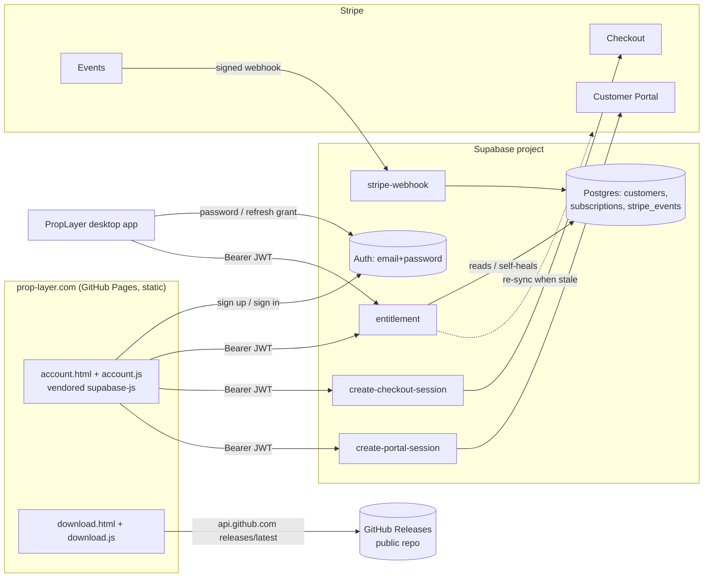

# Accounts and billing — operator runbook

Everything you need to run, change or debug Prop Layer accounts and subscriptions.

**Contract:** PL-ACCOUNT-1 (`contract/`, and section 2 of
[the implementation guide](implementation/PropLayer-Website-Backend-Guide.md)). The desktop
app is built against the same text, so the endpoint names, JSON shapes, reason codes and
error codes here are shared with it. Changing one of them means changing both repositories
in the same release.

---

## 1. How it fits together



The one rule worth internalising: **`GET /functions/v1/entitlement` is the only access
decision.** The website and the app both ask it, and neither recomputes access from a Stripe
status. If someone reports "I paid but the app is locked", that endpoint's answer is the
whole story — check it first.

Stripe is the billing source of truth. `public.subscriptions` is a cache of it, kept current
by the webhook and self-healed on demand, so a missed webhook delays activation by at most
one `entitlement` call rather than breaking it.

---

## 2. Where every secret lives

| Secret | Lives in | Never in |
|---|---|---|
| `STRIPE_SECRET_KEY` | Supabase Edge Function secrets; the operator's `.env` for the scripts | Any tracked file, any browser, the desktop binary |
| `STRIPE_WEBHOOK_SECRET` | Supabase Edge Function secrets | Anywhere else. Stripe reveals it only once, at endpoint creation |
| Supabase service-role / secret key | Provided to functions by the platform; the operator's `.env` for `e2e:billing` | `assets/config.js`, any client |
| `SUPABASE_ACCESS_TOKEN` | The operator's `.env` or shell | Any tracked file |
| `SUPABASE_DB_PASSWORD` | The operator's `.env` or shell | Any tracked file |
| `SMTP_PASS` | Supabase Auth config (set through the Management API by `backend:deploy`) | Any tracked file |

Public by design, and committed deliberately, in `assets/config.js`: the project URL, the
publishable key, the site URL, the releases repository, the plan name and the price to
display. Row Level Security and the in-handler token checks are what protect data — not the
secrecy of the publishable key.

`npm run check:config` scans every **tracked** file for leaked secrets and fails the build
if it finds one. Run it before every deploy; it is cheap and it has no false-positive cost.

```bash
npm run check:config             # warns on __SET_ME__ placeholders
npm run check:config -- --release  # placeholders become a failure
```

---

## 3. First-time setup, in order

Steps 1–4 need a human with account access; 5 onward are scripted.

1. **Choose the price**, and decide whether to enable Stripe Tax. The price is set once, in
   minor units: `--price-cents 1499` is $14.99.
2. **Create the Supabase project.** Prefer a paid plan: free projects pause after a week
   without traffic, which would lock out every paying customer. Create a personal access
   token at Dashboard → Account → Access Tokens.
3. **Activate the Stripe account**: business details and bank account. Describe the product
   accurately — an informational sports overlay, with no wagering. A misdescribed product is
   the usual reason a sports-adjacent account gets reviewed.
4. **Set up SMTP** for `prop-layer.com`, including the SPF and DKIM DNS records. Supabase's
   built-in email only reaches team members and is heavily rate-limited, so password resets
   and confirmations will not work for real customers without this.
5. **Fill in `.env`** from `.env.example`, then:

   ```bash
   npm run backend:deploy -- --write-config
   npm run billing:setup -- --price-cents 1499
   npm run e2e:billing
   ```

   `backend:deploy` links the project, pushes migrations, deploys the four functions, sets
   the function secrets, applies the Auth settings from contract C3, writes the project URL
   and publishable key into `assets/config.js`, and smoke-tests CORS and the 401 envelope.
   `billing:setup` creates the product, the monthly price, the Customer Portal configuration
   and the webhook endpoint, and writes `priceDisplay` into `assets/config.js`.
6. **Finish the Dashboard-only settings** that `billing:setup` prints. The first one matters
   most: Billing → Revenue recovery → Retries must be **retry for up to one week, then
   cancel the subscription**. The entitlement decision relies on it to end access after a
   failed renewal; without it a `past_due` subscription grants access indefinitely.
7. **Create the public releases repository** named in `assets/config.js`
   (`releasesRepo`), and publish a release with the installer, the FFmpeg source archive
   and `SHA256SUMS.txt`.
8. **Have the owner review** the subscription section of `terms.html` and the accounts
   section of `privacy.html`. Both are marked `<!-- OWNER REVIEW REQUIRED -->`.
9. **Commit and push** `assets/config.js` and the rest. GitHub Pages has no build step, so
   pushing is the deploy.

---

## 4. Switching from test to live

Stripe keeps test and live objects entirely separate, so everything in section 3 step 5
happens again with the live key:

```bash
# .env now holds the sk_live_ key
npm run backend:deploy -- --allow-live               # pushes the live key to the functions
npm run billing:setup -- --price-cents 1499 --allow-live
```

`billing:setup` creates a **new** webhook endpoint and portal configuration in live mode and
rewrites `STRIPE_WEBHOOK_SECRET` and `STRIPE_PORTAL_CONFIGURATION_ID` to the live ones. Redo
the Dashboard checklist in live mode — the retry policy and customer emails are per-mode
settings.

`npm run e2e:billing` refuses a live key and always will. After going live, verify with one
real card and then cancel it from the portal.

---

## 5. Day-to-day operations

### Look up a customer's state

Dashboard → Table editor → `subscriptions`, filtered by `user_id`. To find the `user_id`,
look the email up in Authentication → Users. The row's `status`, `current_period_end` and
`cancel_at_period_end` are the inputs to the decision table in contract C5 — the reason code
the customer sees follows from them mechanically.

If the row disagrees with Stripe, the row is wrong and Stripe is right: the next
`entitlement` call re-syncs a stale live subscription automatically, and
`customers.last_synced_at = null` forces a full re-read of that customer.

### Grant a complimentary subscription

There is no code path for this, deliberately. Do it in Stripe:

1. Create a 100%-off coupon (Product catalogue → Coupons), forever or for a fixed number of
   months.
2. Find or create the Stripe customer, and set `metadata.user_id` to their Supabase user id.
   **This is the step people forget** — without it the webhook cannot resolve the owner and
   the subscription is logged as an orphan.
3. Subscribe them to the `proplayer_monthly` price with the coupon applied.

The webhook stores it like any other subscription, and `entitlement` answers `active`.

### Read the function logs

Dashboard → Edge Functions → pick a function → Logs. Entries are single-line JSON with a
`scope`, a `message` and ids. Useful messages:

| Message | Means |
|---|---|
| `entitlement` | A decision was made. Carries `user`, `entitled`, `reason`, `subscription` |
| `event_processed` / `event_duplicate` | A webhook delivery was handled, or was a replay |
| `event_failed` | The handler threw. The event is left unprocessed so Stripe retries |
| `bad_signature` | A request failed signature verification. Carries no body, by design |
| `orphan_subscription` | A subscription has no resolvable owner — see the complimentary-subscription step above |
| `stale_resync_failed` | Stripe was unreachable during an on-demand re-sync; the caller got `502` |
| `price_missing` | No active price has the configured lookup key. Re-run `billing:setup` |

Logs carry ids and outcomes only. There are no tokens, no request bodies and no email
addresses in them, so a log export is safe to share.

### Rotate a key

| Key | How |
|---|---|
| Stripe secret key | Dashboard → Developers → API keys → roll. Put the new value in `.env`, run `npm run backend:deploy`. The old key stops working immediately, so do this in one sitting |
| Stripe webhook secret | `npm run billing:setup -- --recreate-webhook`. It deletes the endpoint, creates a new one and stores the new secret |
| Supabase service-role key | Dashboard → Project Settings → API keys. The platform gives functions the new value; no deploy needed |
| Supabase publishable / anon key | Dashboard → Project Settings → API keys, then `npm run backend:deploy -- --write-config` and commit `assets/config.js` |
| SMTP password | Update `SMTP_PASS` in `.env`, run `npm run backend:deploy` |

### Refunds and disputes

Issue the refund in Stripe. Nothing is needed here: a refund on its own does not cancel the
subscription, so access continues — cancel it in the portal or the Dashboard if that is the
intent. A dispute (chargeback) moves the subscription to `past_due` and then `canceled` on
Stripe's schedule, and each change arrives as a webhook and is synced. Access ends when
Stripe cancels, with no manual step.

---

## 6. The test suites

| Command | What it covers | Needs |
|---|---|---|
| `npm test` | Contract fingerprints, the original site suite, and the account/download suite with every backend call mocked | A browser; `npm run dev` on port 4173 |
| `npm run test:contract` | Contract fingerprints and schema validation, without a browser | Nothing |
| `npm run test:functions` | 151 Deno unit tests: the whole decision table, all four handlers, webhook signatures, sync | Deno |
| `npm run test:db` | The pgTAP RLS suite | Docker, `npx supabase start` |
| `npm run test:db:psql` | The same RLS assertions against a plain PostgreSQL 15+ instance | `DATABASE_URL`, or `PG_BIN` for a throwaway cluster |
| `npm run check:config` | Leaked secrets and placeholders in tracked files | Nothing |
| `npm run e2e:billing` | The real thing, in Stripe test mode, through a test clock | A deployed project and an `sk_test_` key |

Set `PLAYWRIGHT_CHANNEL=chromium` if Google Chrome is not installed.

### What `e2e:billing` proves

It creates a throwaway confirmed user, signs in with the password grant exactly as the
desktop app does, then walks a real subscription through a Stripe test clock and asserts the
`entitlement` answer at each stage: `no_subscription` → `active` (which only happens if the
**deployed** webhook works) → `canceled_pending` with the right `access_until` → `expired`
once the clock passes the period end. Everything it created is deleted afterwards, including
on failure. It prints a pass/fail table.

This is the definitive check that the website, the backend and Stripe agree. The desktop
app's own tests run against this same deployed backend, so a green run here is what lets
both sides trust the contract.

---

## 7. When something is wrong

| Symptom | Look at |
|---|---|
| "Accounts are opening soon" on `account.html` | `assets/config.js` still has `__SET_ME__`. Run `backend:deploy -- --write-config` |
| `entitlement` answers `503 not_configured` | A function secret is missing — almost always `STRIPE_SECRET_KEY`. Re-run `backend:deploy` |
| Customer paid, app stays locked | Call `entitlement` as them. `no_subscription` with a `customers` row means the webhook never resolved an owner: check for `orphan_subscription` in the logs and for `metadata.user_id` on the Stripe customer |
| Activation takes minutes rather than seconds | Check the webhook endpoint's recent deliveries in Stripe. The site also polls for 60 s, and `entitlement` re-reads Stripe after checkout, so this should be rare |
| Everyone with a failed payment keeps access | The Stripe retry policy is not "cancel after one week". Fix it in Billing → Revenue recovery. `PAST_DUE_ENTITLED=false` is the blunt alternative |
| CORS errors in the browser console | The origin is not in `ALLOWED_ORIGINS`. Default is `https://prop-layer.com,http://localhost:4173` |
| Confirmation emails never arrive | SMTP is not configured, so only team members receive mail. See section 3 step 4 |
| `test:functions` fails on a fingerprint | `contract/` no longer matches the desktop repository. Do **not** edit the table to match the code — reconcile the contract in both repositories |
