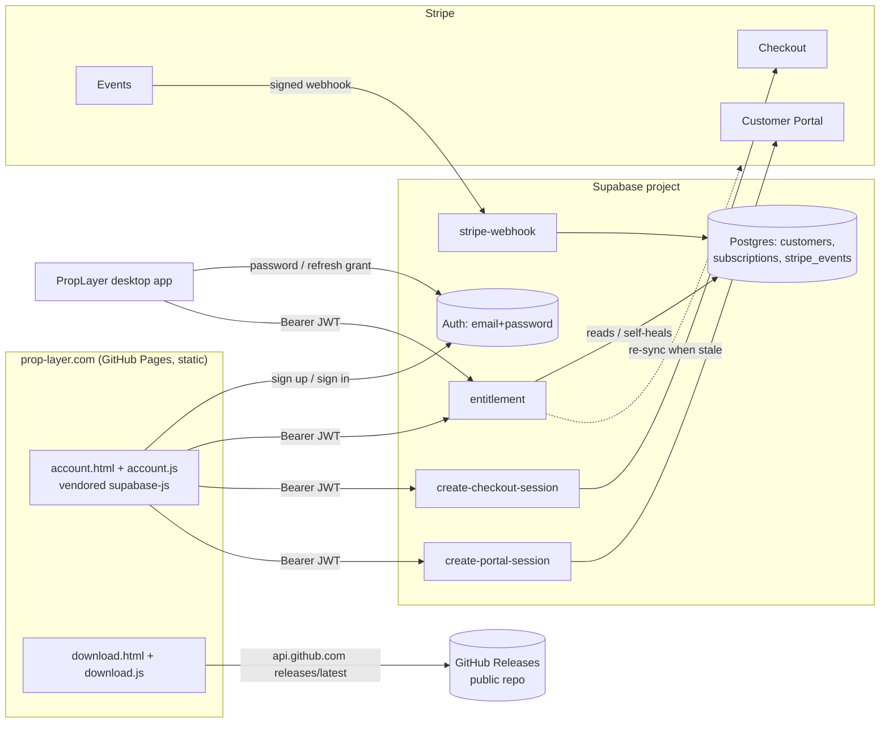
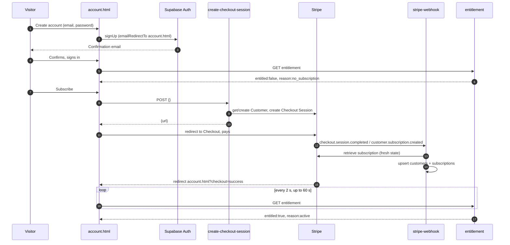

# Prop Layer — Website and Shared Backend Implementation Guide

**Repository:** `PropLayer-Site` (static site at `prop-layer.com`, GitHub Pages)
**Contract:** PL-ACCOUNT-1 (section 2, identical in the desktop guide)
**Goal:** Anyone can download Prop Layer. Visitors create an account, buy a monthly subscription, manage or cancel billing, and the desktop app can ask one endpoint whether that account may run Prop Layer.

---

## 1. Decisions and why

### 1.1 What exists today (keep it)

| Area | Current state | What happens to it |
|---|---|---|
| Hosting | Static HTML/CSS/JS on GitHub Pages, `CNAME` = `prop-layer.com`, no build step | **Kept.** No server is added to the site. New pages are static too |
| Pages | `index.html`, `partners.html`, `privacy.html`, `terms.html`, `logo.html`, `404.html` | Kept. Nav and footer gain *Download* and *Account*; FAQ copy that becomes false is corrected; privacy and terms gain account/billing sections |
| Forms | Formspree endpoint `mpqorvvk` (early access + partnership), validated states, failure keeps input | Kept unchanged in behaviour. Early-access copy is reworded for a paid product (section 6.6) |
| Analytics | GA4 `G-Y0S7K0W3W5`; custom event records only `lead_type` | Kept. New events carry no personal data |
| Fonts/assets | Self-hosted fonts, no runtime font requests | Kept. The Supabase browser library is **vendored** the same way (no CDN at runtime) |
| Tests | `npm test` → `tools/browser-check.cjs` (Playwright + installed Chrome) against `npm run dev` (`tools/serve.cjs`, port 4173). Network calls intercepted | Kept and still green. A second browser suite covers accounts and downloads with all backend calls mocked |
| Backend | None ("No account service or new integration is required") | **New:** one Supabase project + Stripe, defined below. The README statement is updated |

### 1.2 Chosen architecture (simplest that meets every requirement)

| Need | Choice | Why this and not something else |
|---|---|---|
| Accounts shared by website and desktop | **Supabase Auth** (email + password) | Hosted, free tier, works from a static page and from a desktop app over plain HTTPS; email confirmation and password reset built in |
| Subscription payments, renewals, cancellations, card updates, invoices | **Stripe Checkout** + **Stripe Customer Portal** | No payment UI to build or secure; cancellation "at period end" is a portal setting, which gives "keep access through the paid period" for free |
| Subscription tracking | One Postgres table in the same Supabase project, written by a Stripe webhook Edge Function and **self-healed** from Stripe on demand | One vendor for auth + data + server code; no separate server to host |
| The access decision | One Edge Function, `GET entitlement` | Website and desktop ask the same question and get the same answer (contract C5) |
| Public downloads | **GitHub Releases** on a public repository; the site's `download.html` reads the latest release from the GitHub API | Installer is ~117 MB (too big for most static hosts and Supabase Storage's free tier); GitHub Releases is free, versioned, and keeps the FFmpeg source archive on the same page as required by `docs/FFMPEG_COMPLIANCE.md` in the app repo |
| Website hosting | Unchanged GitHub Pages | Reuse working infrastructure |

Not chosen: a custom Node server (more to host and secure), a merchant-of-record platform such as Paddle or Lemon Squeezy (simpler tax handling but a second identity system to bridge — revisit only if sales-tax handling becomes the bottleneck), license keys (the requirement is "sign in with the same account").

### 1.3 Diagrams





---

## 2. Integration contract

## Shared integration contract — PL-ACCOUNT-1

> This whole section is **byte-identical** in the website guide and the desktop guide.
> If either side needs a change, change it in both guides and in both repositories' `contract/` folders in the same release.
> When the guide and the code disagree, the contract wins. When the contract and Stripe or Supabase documentation disagree on a vendor detail, follow the vendor and record the change here.

### C1. Roles and source of truth

| Concern | Owner | Notes |
|---|---|---|
| Identity (email + password accounts) | Supabase Auth (one project) | Same account on the website and in the desktop app |
| Payment, renewal, cancellation, invoices | Stripe Checkout + Stripe Customer Portal | Stripe is the billing source of truth |
| Subscription state the app relies on | `public.subscriptions` table in Supabase, kept current by the Stripe webhook and self-healed from Stripe on demand | Written only by Edge Functions using the service role |
| "May this user run Prop Layer right now?" | `GET /functions/v1/entitlement` | **The only access decision.** Clients never recompute it from Stripe statuses |
| Installer hosting | Public GitHub repository's Releases | Public download, no sign-in required |
| Website | Existing static site on GitHub Pages (`prop-layer.com`) | No server is added to the site itself |

### C2. Public configuration values

These are public by design (the publishable key is safe to ship in a browser or a desktop binary; security comes from Row Level Security and server-side checks). They appear in exactly one file per repository.

| Value | Example / default | Website: `assets/config.js` | Desktop: `src/account/backend.json` |
|---|---|---|---|
| Supabase project URL | `https://<project-ref>.supabase.co` | `supabaseUrl` | `supabaseUrl` |
| Supabase publishable key | `sb_publishable_…` (a legacy `anon` JWT also works) | `supabasePublishableKey` | `publishableKey` |
| Site URL | `https://prop-layer.com` | `siteUrl` | `siteUrl` |
| Releases repository | `CryptoCoder123/PropLayer-Releases` (owner confirms the name) | `releasesRepo` | `package.json` → `"proplayer": { "releasesRepo": … }` |
| Plan identifier (Stripe Price lookup key) | `proplayer_monthly` | display only (`planName`, `priceDisplay`) | not used |

Unconfigured placeholder value in both repositories: the literal string `__SET_ME__`. Both sides must detect it and degrade safely (website: "Accounts are not available yet"; desktop development build: an explicit "backend not configured" state; desktop release build: the build fails).

Secrets (Stripe secret key, webhook signing secret, Supabase secret/service-role key, SMTP password) live **only** in Supabase Edge Function secrets or the operator's shell environment. They are never committed, never placed in `assets/config.js` or `backend.json`, and never logged.

### C3. Authentication

Accounts are created only on the website. The desktop app signs in to the same Supabase project.

| Setting (Supabase Auth) | Value |
|---|---|
| Provider | Email + password only (no OAuth at launch) |
| Email confirmation | Required |
| Minimum password length | 8 |
| Access-token (JWT) lifetime | 3600 s (default) |
| Refresh-token rotation | On (default). Reuse interval 10 s (default) |
| Site URL | `https://prop-layer.com` |
| Allowed redirect URLs | `https://prop-layer.com/account.html`, `http://localhost:4173/account.html` |

Desktop calls Supabase Auth over plain HTTPS (no SDK). Every request sends `apikey: <publishable key>` and `Content-Type: application/json`.

| Operation | Request | Success |
|---|---|---|
| Sign in | `POST {supabaseUrl}/auth/v1/token?grant_type=password` body `{"email","password"}` | `200` `{access_token, token_type:"bearer", expires_in, expires_at, refresh_token, user:{id,email,…}}` |
| Refresh | `POST {supabaseUrl}/auth/v1/token?grant_type=refresh_token` body `{"refresh_token"}` | `200`, same shape. **The returned `refresh_token` replaces the stored one immediately** (rotation) |
| Sign out | `POST {supabaseUrl}/auth/v1/logout?scope=local` header `Authorization: Bearer <access_token>` | `204`. Failure is ignored; local data is deleted regardless |

Auth error mapping. Supabase returns either `{"code":…, "error_code":"…", "msg":"…"}` or the legacy `{"error":"…", "error_description":"…"}`; parse both.

| Condition | User-facing message (desktop and website) |
|---|---|
| `error_code` = `invalid_credentials`, or legacy `invalid_grant` on password sign-in | "Email or password is incorrect." |
| `error_code` = `email_not_confirmed` | "Confirm your email first — check your inbox, then sign in." |
| HTTP `429` | "Too many attempts. Wait a few minutes and try again." |
| Refresh returns any `4xx` | Session is over: delete the stored session, show the signed-out screen with "Please sign in again." |
| Network error, timeout (10 s), or `5xx` | Treated as **offline** (see C6), never as signed out |

### C4. Edge Function endpoints

Base: `{supabaseUrl}/functions/v1/`. All requests send `apikey: <publishable key>` and `Authorization: Bearer <user access_token>` (except the webhook). The desktop also sends `X-PropLayer-Client: desktop/<app version> (win32)`. Every response body is JSON with `Content-Type: application/json` and `Cache-Control: no-store`.

| Endpoint | Method | Caller | Success | Errors |
|---|---|---|---|---|
| `entitlement` | `GET` | website, desktop | `200` entitlement object (C5) | `401 unauthorized`, `405 method_not_allowed`, `500 internal`, `502 stripe_error` (an on-demand Stripe re-sync was needed and failed), `503 not_configured` |
| `create-checkout-session` | `POST` body `{}` | website | `200 {"url":"https://checkout.stripe.com/…"}` | `401`, `409 already_subscribed`, `502 stripe_error`, `503 not_configured` |
| `create-portal-session` | `POST` body `{}` | website | `200 {"url":"https://billing.stripe.com/…"}` | `401`, `404 no_customer`, `502 stripe_error`, `503 not_configured` |
| `stripe-webhook` | `POST` | Stripe only | `200 {"received":true}` | `400 bad_signature` |

Error envelope (all endpoints): `{"error":"<code>","message":"<human readable>"}`. Codes are exactly: `unauthorized`, `method_not_allowed`, `already_subscribed`, `no_customer`, `bad_signature`, `stripe_error`, `not_configured`, `internal`.

CORS (browser callers): `Access-Control-Allow-Origin` echoes the request origin only when it is in the `ALLOWED_ORIGINS` secret (default `https://prop-layer.com,http://localhost:4173`); `Access-Control-Allow-Headers: authorization, apikey, content-type, x-client-info, x-proplayer-client`; `Access-Control-Allow-Methods: GET, POST, OPTIONS`; `OPTIONS` answers `204`. The desktop app is not subject to CORS.

Authentication inside functions: every function except `stripe-webhook` validates the bearer token **inside the handler** (Supabase Auth `getUser(token)` or the official `@supabase/server` helper) and rejects with `401` when invalid. Gateway JWT verification (`verify_jwt`) is set to `false` for all four functions so behaviour is identical with legacy and new Supabase API keys; the in-handler check is therefore mandatory.

### C5. Entitlement object (schema 1)

`GET entitlement` returns exactly this shape. Clients must ignore fields they do not know; servers must not add fields without updating `contract/entitlement.v1.schema.json` in both repositories. Timestamps are RFC 3339 UTC with second precision and a `Z` suffix.

| Field | Meaning |
|---|---|
| `schema` | Always `1` |
| `user` | `{id, email}` of the token's user |
| `entitled` | **The access decision.** `true` = may run the overlay and processing service |
| `reason` | Why (table below) |
| `subscription` | `null` when the user never subscribed; otherwise the most relevant subscription |
| `subscription.plan` | Stripe Price lookup key (`proplayer_monthly`) |
| `subscription.access_until` | When access ends unless renewed. Non-null whenever `entitled` is `true` |
| `checked_at` | Server time of this decision |
| `recheck_after_seconds` | When a running client should ask again (server default 3600; contract range 300–86400) |
| `offline_grace_seconds` | How long a client may keep running on its last successful `entitled:true` answer while the backend is unreachable (server default 259200 = 72 h) |
| `links` | Website pages the client opens for subscribe / manage billing / download |

Decision table (server side; "now" is server time; "period end" is the subscription item's `current_period_end`; a scheduled cancellation is `cancel_at_period_end = true` **or** a non-null `cancel_at`):

| Stripe status | Condition | `entitled` | `reason` | `access_until` |
|---|---|---|---|---|
| `active` | period end > now, no scheduled cancellation | `true` | `active` | period end |
| `active` | period end > now, cancellation scheduled | `true` | `canceled_pending` | `min(period end, cancel_at)` |
| `trialing` | period end > now | `true` | `trialing` (or `canceled_pending` if cancellation scheduled) | period end |
| `past_due` | `PAST_DUE_ENTITLED=true` (default) | `true` | `past_due_grace` | period end |
| `past_due` | `PAST_DUE_ENTITLED=false` | `false` | `payment_failed` | `null` |
| `unpaid` | — | `false` | `payment_failed` | `null` |
| `incomplete` | — | `false` | `incomplete` | `null` |
| `incomplete_expired`, `canceled`, `paused` | — | `false` | `expired` | `null` |
| `active` / `trialing` / `past_due` | period end ≤ now **after** an on-demand Stripe re-sync | `false` | `expired` | `null` |
| (none) | user has never had a subscription | `false` | `no_subscription` | `null`, and `subscription` is `null` |

"Most relevant subscription" = an entitled one if any exists, otherwise the most recently created one.

`past_due` grace is bounded by Stripe's retry schedule: Stripe Billing settings must be "retry for up to 1 week, then cancel the subscription", so a failed renewal ends access automatically.

Canonical fixtures (both repositories keep identical copies in `contract/fixtures/` and test against them):

`contract/fixtures/entitlement.active.json`
```json
{
  "schema": 1,
  "user": {
    "id": "3f6c2a1e-8b4d-4c1a-9e2f-5a7b9c0d1e2f",
    "email": "fan@example.com"
  },
  "entitled": true,
  "reason": "active",
  "subscription": {
    "status": "active",
    "plan": "proplayer_monthly",
    "current_period_end": "2026-11-03T16:00:00Z",
    "cancel_at_period_end": false,
    "access_until": "2026-11-03T16:00:00Z"
  },
  "checked_at": "2026-10-03T16:00:00Z",
  "recheck_after_seconds": 3600,
  "offline_grace_seconds": 259200,
  "links": {
    "account": "https://prop-layer.com/account.html",
    "subscribe": "https://prop-layer.com/account.html#subscribe",
    "manage": "https://prop-layer.com/account.html#billing",
    "download": "https://prop-layer.com/download.html"
  }
}
```

`contract/fixtures/entitlement.canceled_pending.json`
```json
{
  "schema": 1,
  "user": {
    "id": "3f6c2a1e-8b4d-4c1a-9e2f-5a7b9c0d1e2f",
    "email": "fan@example.com"
  },
  "entitled": true,
  "reason": "canceled_pending",
  "subscription": {
    "status": "active",
    "plan": "proplayer_monthly",
    "current_period_end": "2026-10-20T16:00:00Z",
    "cancel_at_period_end": true,
    "access_until": "2026-10-20T16:00:00Z"
  },
  "checked_at": "2026-10-03T16:00:00Z",
  "recheck_after_seconds": 3600,
  "offline_grace_seconds": 259200,
  "links": {
    "account": "https://prop-layer.com/account.html",
    "subscribe": "https://prop-layer.com/account.html#subscribe",
    "manage": "https://prop-layer.com/account.html#billing",
    "download": "https://prop-layer.com/download.html"
  }
}
```

`contract/fixtures/entitlement.past_due_grace.json`
```json
{
  "schema": 1,
  "user": {
    "id": "3f6c2a1e-8b4d-4c1a-9e2f-5a7b9c0d1e2f",
    "email": "fan@example.com"
  },
  "entitled": true,
  "reason": "past_due_grace",
  "subscription": {
    "status": "past_due",
    "plan": "proplayer_monthly",
    "current_period_end": "2026-11-01T16:00:00Z",
    "cancel_at_period_end": false,
    "access_until": "2026-11-01T16:00:00Z"
  },
  "checked_at": "2026-10-03T16:00:00Z",
  "recheck_after_seconds": 3600,
  "offline_grace_seconds": 259200,
  "links": {
    "account": "https://prop-layer.com/account.html",
    "subscribe": "https://prop-layer.com/account.html#subscribe",
    "manage": "https://prop-layer.com/account.html#billing",
    "download": "https://prop-layer.com/download.html"
  }
}
```

`contract/fixtures/entitlement.expired.json`
```json
{
  "schema": 1,
  "user": {
    "id": "3f6c2a1e-8b4d-4c1a-9e2f-5a7b9c0d1e2f",
    "email": "fan@example.com"
  },
  "entitled": false,
  "reason": "expired",
  "subscription": {
    "status": "canceled",
    "plan": "proplayer_monthly",
    "current_period_end": "2026-09-30T16:00:00Z",
    "cancel_at_period_end": false,
    "access_until": null
  },
  "checked_at": "2026-10-03T16:00:00Z",
  "recheck_after_seconds": 3600,
  "offline_grace_seconds": 259200,
  "links": {
    "account": "https://prop-layer.com/account.html",
    "subscribe": "https://prop-layer.com/account.html#subscribe",
    "manage": "https://prop-layer.com/account.html#billing",
    "download": "https://prop-layer.com/download.html"
  }
}
```

`contract/fixtures/entitlement.no_subscription.json`
```json
{
  "schema": 1,
  "user": {
    "id": "3f6c2a1e-8b4d-4c1a-9e2f-5a7b9c0d1e2f",
    "email": "fan@example.com"
  },
  "entitled": false,
  "reason": "no_subscription",
  "subscription": null,
  "checked_at": "2026-10-03T16:00:00Z",
  "recheck_after_seconds": 3600,
  "offline_grace_seconds": 259200,
  "links": {
    "account": "https://prop-layer.com/account.html",
    "subscribe": "https://prop-layer.com/account.html#subscribe",
    "manage": "https://prop-layer.com/account.html#billing",
    "download": "https://prop-layer.com/download.html"
  }
}
```

`contract/fixtures/error.unauthorized.json`
```json
{
  "error": "unauthorized",
  "message": "Sign in again."
}
```

JSON Schema 2020-12. Both repositories validate the fixtures against it, and the backend validates its own output against it in tests.

`contract/entitlement.v1.schema.json`
```json
{
  "$schema": "https://json-schema.org/draft/2020-12/schema",
  "$id": "https://prop-layer.com/contract/entitlement.v1.schema.json",
  "title": "PropLayer entitlement response (contract PL-ACCOUNT-1, schema 1)",
  "type": "object",
  "additionalProperties": false,
  "required": ["schema", "user", "entitled", "reason", "subscription", "checked_at", "recheck_after_seconds", "offline_grace_seconds", "links"],
  "properties": {
    "schema": { "const": 1 },
    "user": {
      "type": "object",
      "additionalProperties": false,
      "required": ["id", "email"],
      "properties": {
        "id": { "type": "string", "pattern": "^[0-9a-f]{8}-[0-9a-f]{4}-[0-9a-f]{4}-[0-9a-f]{4}-[0-9a-f]{12}$" },
        "email": { "type": "string", "minLength": 3 }
      }
    },
    "entitled": { "type": "boolean" },
    "reason": {
      "enum": ["active", "trialing", "canceled_pending", "past_due_grace", "no_subscription", "expired", "payment_failed", "incomplete"]
    },
    "subscription": {
      "oneOf": [
        { "type": "null" },
        {
          "type": "object",
          "additionalProperties": false,
          "required": ["status", "plan", "current_period_end", "cancel_at_period_end", "access_until"],
          "properties": {
            "status": { "enum": ["incomplete", "incomplete_expired", "trialing", "active", "past_due", "canceled", "unpaid", "paused"] },
            "plan": { "type": "string", "minLength": 1 },
            "current_period_end": { "type": ["string", "null"], "pattern": "^\\d{4}-\\d{2}-\\d{2}T\\d{2}:\\d{2}:\\d{2}Z$" },
            "cancel_at_period_end": { "type": "boolean" },
            "access_until": { "type": ["string", "null"], "pattern": "^\\d{4}-\\d{2}-\\d{2}T\\d{2}:\\d{2}:\\d{2}Z$" }
          }
        }
      ]
    },
    "checked_at": { "type": "string", "pattern": "^\\d{4}-\\d{2}-\\d{2}T\\d{2}:\\d{2}:\\d{2}Z$" },
    "recheck_after_seconds": { "type": "integer", "minimum": 300, "maximum": 86400 },
    "offline_grace_seconds": { "type": "integer", "minimum": 0, "maximum": 604800 },
    "links": {
      "type": "object",
      "additionalProperties": false,
      "required": ["account", "subscribe", "manage", "download"],
      "properties": {
        "account":   { "type": "string", "pattern": "^https://" },
        "subscribe": { "type": "string", "pattern": "^https://" },
        "manage":    { "type": "string", "pattern": "^https://" },
        "download":  { "type": "string", "pattern": "^https://" }
      }
    }
  },
  "allOf": [
    {
      "if": { "properties": { "entitled": { "const": true } } },
      "then": {
        "properties": {
          "reason": { "enum": ["active", "trialing", "canceled_pending", "past_due_grace"] },
          "subscription": { "type": "object", "properties": { "access_until": { "type": "string" } } }
        }
      },
      "else": {
        "properties": { "reason": { "enum": ["no_subscription", "expired", "payment_failed", "incomplete"] } }
      }
    },
    {
      "if": { "properties": { "reason": { "const": "no_subscription" } } },
      "then": { "properties": { "subscription": { "type": "null" } } },
      "else": { "properties": { "subscription": { "type": "object" } } }
    }
  ]
}
```

Canonical fingerprints. Each repository has a test that, for every file below, computes `sha256( JSON.stringify( JSON.parse(fileText) ) )` (UTF-8, Node/Deno default `JSON.stringify` with no spacing; key order as written) and compares it with this table. A mismatch means the two repositories no longer share the same contract.

| File | Canonical SHA-256 |
|---|---|
| `contract/entitlement.v1.schema.json` | `bab60e69041ce0ab176b442b34a4e0905f636015f88c5da5e80c3acdedf7fd95` |
| `contract/fixtures/entitlement.active.json` | `c9dce7b73a2ed741251906f7e1601996f78433efdf5285d77316523a4d4a968e` |
| `contract/fixtures/entitlement.canceled_pending.json` | `f66b3082d1b11e126eafcc49b87ab5186c855114be40684aa8b87fdcfa1e30c3` |
| `contract/fixtures/entitlement.expired.json` | `ad9f621c3a92526ddd46d56b4523318fca6fd380c8dd42dec7f6da0a3f0d1ffa` |
| `contract/fixtures/entitlement.no_subscription.json` | `4f0d13e98e8d3414a99dcfae84297011ae9a12417410f6e1d6ef024a9708e571` |
| `contract/fixtures/entitlement.past_due_grace.json` | `7fb8538b8b9a3968cc743e3d115e406438b5b19eaf1efc4dda86ffe57a3b55ec` |
| `contract/fixtures/error.unauthorized.json` | `254d62981e0310600d51edefae825611918e98789e6dc2b6c8953b3d91681fe3` |

### C6. Client enforcement rules (desktop)

1. The overlay window, the controls strip, detection start (▶, `set-running`), the `Ctrl+Shift+P` hotkey and the sidecar process are available **only** while the client state is `entitled` or `offline_grace`. In every other state only the Account window and the tray (Account…, Quit) are usable.
2. Online answer with `entitled:true` → state `entitled`. `entitled:false` → state `not_entitled`; the running sidecar is stopped gracefully within 5 s and the overlay and controls are hidden.
3. Recheck while entitled: at `min(now + recheck_after_seconds, access_until + 60 s)`, on system resume and screen unlock, and when the user presses **Re-check**. A not-entitled client rechecks only on user action (Sign in, Re-check, Account window focus), never on a timer.
4. Offline (network error, timeout, `5xx`): if the last stored online answer was `entitled:true`, was received less than `offline_grace_seconds` ago by the local clock, the local clock has not moved more than 5 minutes **behind** the time that answer was received, and that answer did not have a scheduled cancellation whose `access_until` has already passed → state `offline_grace` (keeps running; retries every 5 min, backing off to 30 min). Otherwise → state `offline_locked`.
5. A `401` from `entitlement` triggers one token refresh and one retry. A refresh `4xx` → state `signed_out` and the stored session is deleted.
6. The client never stores the password. It stores only the refresh token, the user's `{id,email}` and the last entitlement answer with its local receive time, encrypted with the operating system's user-scoped protection (Windows DPAPI via Electron `safeStorage`). If OS encryption is unavailable, nothing is persisted (the user signs in each launch); plaintext token storage is never allowed.
7. Users who cancel keep access until `access_until`; this falls out of rules 2–4 with no client-side special case.

### C7. Website pages the desktop opens

| Purpose | URL |
|---|---|
| Create account | `https://prop-layer.com/account.html#signup` |
| Forgot password | `https://prop-layer.com/account.html#forgot` |
| Subscribe | `links.subscribe` (default `https://prop-layer.com/account.html#subscribe`) |
| Manage billing / cancel / update card | `links.manage` (default `https://prop-layer.com/account.html#billing`) |
| Download | `links.download` (default `https://prop-layer.com/download.html`) |

The desktop opens only `https://` URLs whose origin equals `siteUrl`, using the system browser.

### C8. Releases and downloads

| Item | Value |
|---|---|
| Repository | `releasesRepo` (public). The application source repository may stay private |
| Tag | `v<package.json version>`, e.g. `v0.1.0` |
| Required assets (exact names produced by `npm run dist`) | `PropLayer-Setup-<version>.exe`, `PropLayer-ffmpeg-source-electron-v<electron>-win32-x64.zip`, `SHA256SUMS.txt` |
| Release body | Contents of `dist/DOWNLOAD-NOTICE.md` (the FFmpeg/LGPL notice must sit on the same page as the installer) |
| State | Published, not draft, not pre-release, marked latest |
| How the website finds it | `GET https://api.github.com/repos/<releasesRepo>/releases/latest` (unauthenticated, CORS-enabled); installer = asset matching `^PropLayer-Setup-(\d+\.\d+\.\d+)\.exe$`; SHA-256 from the asset's `digest` field (`sha256:<hex>`) when present, otherwise link `SHA256SUMS.txt`; fallback link `https://github.com/<releasesRepo>/releases/latest` |

Downloads never require an account. Access is enforced by the app, not by hiding the installer.

### C9. Contract test obligations

| Repository | Must prove |
|---|---|
| Both | `contract/` files match the canonical fingerprints in C5 |
| Website/backend | The entitlement builder returns schema-valid objects matching every fixture for the equivalent database/Stripe state; every decision-table row; error envelopes and status codes; webhook signature rejection; idempotent event handling; RLS blocks cross-user reads and all client writes |
| Desktop | The client parses every fixture into the right state; offline-grace boundaries (just inside / just outside, clock rollback, ended cancellation); refresh rotation persists the new token; refresh `4xx` signs out; the sidecar cannot start in any non-entitled state; entitlement loss mid-session stops the sidecar and hides the overlay |


---

## 3. Repository changes at a glance

```
PropLayer-Site/
├── account.html                     NEW  sign up / sign in / reset / subscription / billing
├── download.html                    NEW  public download page (latest GitHub release)
├── index.html                       EDIT nav, pricing section, FAQ truth, CTA
├── partners.html, privacy.html, terms.html, 404.html, logo.html   EDIT nav/footer links; privacy+terms sections
├── sitemap.xml                      EDIT add download.html (NOT account.html)
├── assets/
│   ├── config.js                    NEW  public config (contract C2)
│   ├── account.js                   NEW
│   ├── download.js                  NEW
│   ├── analytics.js                 NEW  gtag bootstrap as a file (CSP on the new pages)
│   ├── vendor/supabase.js           NEW  vendored UMD build of @supabase/supabase-js (pinned)
│   ├── vendor/SUPABASE-LICENSE.txt  NEW  MIT licence text
│   └── site.css                     EDIT styles for the new pages, using existing tokens
├── contract/                        NEW  entitlement.v1.schema.json, fixtures/, FINGERPRINTS.md (contract C5)
├── supabase/
│   ├── config.toml                  NEW  local dev + function settings
│   ├── migrations/20261003000000_accounts_billing.sql   NEW
│   ├── tests/database/rls.test.sql  NEW  pgTAP (runs when the local stack is available)
│   └── functions/
│       ├── _shared/                 NEW  env, http, cors, auth, stripe, db, entitlement (pure), sync
│       ├── entitlement/index.ts
│       ├── create-checkout-session/index.ts
│       ├── create-portal-session/index.ts
│       ├── stripe-webhook/index.ts
│       └── tests/*.test.ts          NEW  Deno unit tests (no network)
├── scripts/
│   ├── vendor-supabase.mjs          NEW  copy pinned UMD build into assets/vendor
│   ├── deploy-backend.mjs           NEW  link, migrate, deploy functions, set secrets, apply auth settings, write config.js
│   ├── setup-billing.mjs            NEW  idempotent Stripe product/price/portal/webhook setup
│   ├── check-config.mjs             NEW  secret-leak + placeholder checks
│   └── e2e-billing.mjs              NEW  test-mode end-to-end with Stripe test clocks
├── tools/
│   ├── browser-check.cjs            EDIT only where existing assertions depend on changed copy/links
│   └── account-check.cjs            NEW  account + download browser suite (all network mocked)
├── docs/ACCOUNTS_AND_BILLING.md     NEW  operator runbook (section 9)
├── .env.example                     NEW  every variable the scripts read, no values
├── package.json                     EDIT scripts + dev dependencies
└── README.md                        EDIT replace "no account service" statements
```

`package.json` scripts (keep `dev` and the existing `test` behaviour):

```json
{
  "scripts": {
    "dev": "node tools/serve.cjs",
    "test": "node tools/browser-check.cjs && node tools/account-check.cjs",
    "test:site": "node tools/browser-check.cjs",
    "test:account": "node tools/account-check.cjs",
    "test:functions": "deno test --allow-env --allow-read --allow-net=127.0.0.1 supabase/functions/tests",
    "test:db": "supabase test db",
    "check:config": "node scripts/check-config.mjs",
    "vendor:supabase": "node scripts/vendor-supabase.mjs",
    "backend:deploy": "node scripts/deploy-backend.mjs",
    "billing:setup": "node scripts/setup-billing.mjs",
    "e2e:billing": "node scripts/e2e-billing.mjs"
  }
}
```

Dev dependencies to add (exact versions pinned in `package-lock.json`): `@supabase/supabase-js` (source of the vendored UMD file only), `stripe` (setup and e2e scripts), `supabase` (CLI, so `npx supabase` works without a global install), `ajv` + `ajv-formats` (contract checks in Node). Production dependencies: still none.

---

## 4. Database

Create `supabase/migrations/20261003000000_accounts_billing.sql` exactly as below (validated against PostgreSQL 16 with Supabase's `anon`/`authenticated` roles: own-row reads succeed; client inserts, updates, `stripe_events` reads and anonymous reads are denied; unknown statuses are rejected; deleting a user cascades).

```sql
-- supabase/migrations/20261003000000_accounts_billing.sql
-- Accounts and billing for contract PL-ACCOUNT-1.
-- Clients may READ their own rows. Only Edge Functions (service role, which bypasses RLS) write.

create table public.customers (
  user_id            uuid primary key references auth.users (id) on delete cascade,
  stripe_customer_id text not null unique,
  last_synced_at     timestamptz,
  created_at         timestamptz not null default now()
);

create table public.subscriptions (
  id                   text primary key,                    -- Stripe subscription id (sub_...)
  user_id              uuid not null references auth.users (id) on delete cascade,
  stripe_customer_id   text not null,
  status               text not null check (status in (
                         'incomplete', 'incomplete_expired', 'trialing', 'active',
                         'past_due', 'canceled', 'unpaid', 'paused')),
  price_id             text,
  price_lookup_key     text,
  current_period_end   timestamptz,                         -- from the subscription ITEM (Stripe API >= 2025-03-31)
  cancel_at_period_end boolean not null default false,
  cancel_at            timestamptz,
  canceled_at          timestamptz,
  ended_at             timestamptz,
  livemode             boolean not null default false,
  stripe_created_at    timestamptz not null,
  updated_at           timestamptz not null default now()
);

create index subscriptions_user_id_idx  on public.subscriptions (user_id);
create index subscriptions_customer_idx on public.subscriptions (stripe_customer_id);

-- Webhook idempotency ledger. Never exposed to clients.
create table public.stripe_events (
  id           text primary key,                            -- Stripe event id (evt_...)
  type         text not null,
  received_at  timestamptz not null default now(),
  processed_at timestamptz
);

alter table public.customers     enable row level security;
alter table public.subscriptions enable row level security;
alter table public.stripe_events enable row level security;

create policy "customers_select_own" on public.customers
  for select to authenticated using (user_id = (select auth.uid()));

create policy "subscriptions_select_own" on public.subscriptions
  for select to authenticated using (user_id = (select auth.uid()));

-- No insert/update/delete policies exist, so RLS denies all client writes.
-- Belt and braces: remove table privileges clients never need.
revoke insert, update, delete, truncate on public.customers     from anon, authenticated;
revoke insert, update, delete, truncate on public.subscriptions from anon, authenticated;
revoke all                              on public.stripe_events from anon, authenticated;
revoke select                           on public.customers     from anon;
revoke select                           on public.subscriptions from anon;
```

`supabase/tests/database/rls.test.sql` (pgTAP, run by `supabase test db` when Docker is available) must assert: user A sees only A's `customers` and `subscriptions` rows; `authenticated` cannot insert/update/delete either table; `anon` cannot select either table; nobody but the service role can read `stripe_events`.

---

## 5. Edge Functions

### 5.1 Layout and conventions

- Runtime: Supabase Edge Functions (Deno). Import Stripe as `npm:stripe@<exact version>` and Supabase as `npm:@supabase/supabase-js@<exact version>`; pin both.
- Stripe client: `new Stripe(key, { httpClient: Stripe.createFetchHttpClient() })`. Do **not** pin an older `apiVersion`; use the SDK's default and write code for the current object shapes (5.6).
- Every handler is built as `createHandler(deps)` where `deps = { env, now(), stripe, db, auth, log }`. `index.ts` wires real dependencies; tests pass fakes. No test touches the network.
- `supabase/config.toml` sets `verify_jwt = false` for all four functions (contract C4); the in-handler auth check is mandatory.
- Service-role database access: use `SUPABASE_SERVICE_ROLE_KEY` when present; otherwise read the `default` entry from the `SUPABASE_SECRET_KEYS` JSON (newer projects). Fail closed with `503 not_configured` when neither exists.
- Logging: log event ids, subscription ids, user ids and outcomes. Never log tokens, email addresses with payment details, request bodies of the webhook, or secrets.

`supabase/functions/_shared/` modules:

| Module | Responsibility |
|---|---|
| `env.ts` | Read and validate secrets (5.2); typed config object; `isConfigured()` |
| `http.ts` | `json(status, body)` with `Content-Type: application/json` and `Cache-Control: no-store`; `error(status, code, message)` producing the contract envelope |
| `cors.ts` | Contract C4 CORS; `OPTIONS` → `204` |
| `auth.ts` | Extract `Authorization: Bearer`, validate with Supabase Auth (`auth.getUser(token)` via the service client, or `@supabase/server`'s user helper). Returns `{id,email}` or throws `401 unauthorized` |
| `stripe.ts` | Stripe client factory; `periodEnd(sub)`; `subscriptionIdFromInvoice(inv)`; price lookup by lookup key with a 10-minute in-memory cache |
| `db.ts` | Small typed wrapper: `getCustomer(userId)`, `getCustomerByStripeId(id)`, `insertCustomer`, `listSubscriptions(userId)`, `upsertSubscription(row)`, `markSynced(userId)`, `recordEvent`, `markEventProcessed` |
| `entitlement.ts` | **Pure** `decide(rows, now, cfg)` implementing the contract C5 decision table, and `buildResponse(user, decision, now, cfg)`. No I/O |
| `sync.ts` | `syncSubscription(stripeSubId)` and `syncCustomer(stripeCustomerId)` — fetch fresh from Stripe, resolve the user, upsert |

### 5.2 Secrets (Edge Function environment)

| Name | Required | Default | Purpose |
|---|---|---|---|
| `STRIPE_SECRET_KEY` | yes | — | `sk_test_…` first, `sk_live_…` at launch |
| `STRIPE_WEBHOOK_SECRET` | yes (webhook) | — | `whsec_…`, set by `setup-billing.mjs` |
| `STRIPE_PRICE_LOOKUP_KEY` | no | `proplayer_monthly` | Contract C2 |
| `STRIPE_PORTAL_CONFIGURATION_ID` | no | Stripe default | Set by `setup-billing.mjs` |
| `STRIPE_AUTOMATIC_TAX` | no | `false` | `true` enables Stripe Tax in Checkout (requires Stripe Tax activated) |
| `SITE_URL` | no | `https://prop-layer.com` | Return URLs and `links` |
| `ALLOWED_ORIGINS` | no | `https://prop-layer.com,http://localhost:4173` | CORS |
| `ENTITLEMENT_RECHECK_SECONDS` | no | `3600` | Contract C5, clamped 300–86400 |
| `OFFLINE_GRACE_SECONDS` | no | `259200` | Contract C5, clamped 0–604800 |
| `PAST_DUE_ENTITLED` | no | `true` | Contract C5 |
| `SUPABASE_URL`, `SUPABASE_SERVICE_ROLE_KEY` / `SUPABASE_SECRET_KEYS` | provided by the platform | — | Service-role DB access and token validation |

### 5.3 `entitlement` (GET)

1. CORS; `OPTIONS` → `204`; any method other than `GET` → `405 method_not_allowed`.
2. Not configured → `503 not_configured`.
3. Authenticate → `{id,email}` or `401`.
4. `rows = listSubscriptions(user.id)`; `d = decide(rows, now)`.
5. **Self-heal** (keeps paying users unlocked when a webhook was missed or delayed):
   - (a) the most relevant row is `active`/`trialing`/`past_due` but its period end ≤ now → `syncSubscription(row.id)`, then recompute;
   - (b) no entitled row, but a `customers` row exists and `last_synced_at` is null or older than 10 minutes → `syncCustomer(customer)` (list that customer's subscriptions, `status: 'all'`, limit 10, upsert each), `markSynced`, recompute. Together with step 6 of `create-checkout-session` (which clears `last_synced_at`), this makes post-checkout activation immediate even when the webhook is slow, including for returning customers.
   - If the Stripe call fails in (a) → `502 stripe_error` (the desktop treats `5xx` as offline and keeps any grace it has). If it fails in (b) → return the database decision.
6. `200` with `buildResponse(...)`. Output must validate against `contract/entitlement.v1.schema.json`.

### 5.4 `create-checkout-session` (POST)

1. CORS, method, configuration, auth as above.
2. If `decide(...)` is entitled → `409 already_subscribed` ("You already have an active subscription. Use Manage billing.").
3. Customer: existing `customers` row, else `stripe.customers.create({ email, metadata: { user_id } }, { idempotencyKey: 'customer-' + user.id })`, insert with `on conflict (user_id) do nothing`, then re-read (handles double-clicks and races).
4. Price: `prices.list({ lookup_keys: [STRIPE_PRICE_LOOKUP_KEY], active: true, limit: 1 })`; none → `503 not_configured`.
5. `checkout.sessions.create({ mode: 'subscription', customer, client_reference_id: user.id, line_items: [{ price, quantity: 1 }], subscription_data: { metadata: { user_id } }, allow_promotion_codes: true, success_url: SITE_URL + '/account.html?checkout=success', cancel_url: SITE_URL + '/account.html?checkout=canceled#subscribe' })`. When `STRIPE_AUTOMATIC_TAX=true` add `automatic_tax: { enabled: true }`, `customer_update: { address: 'auto' }`, `billing_address_collection: 'required'`.
6. Set `customers.last_synced_at = null` so the next `entitlement` call re-syncs from Stripe.
7. `200 {url}`. Stripe errors → `502 stripe_error` (log the Stripe request id).

### 5.5 `create-portal-session` (POST)

1. CORS, method, configuration, auth.
2. No `customers` row → `404 no_customer`.
3. `billingPortal.sessions.create({ customer, return_url: SITE_URL + '/account.html#billing', configuration: STRIPE_PORTAL_CONFIGURATION_ID || undefined })` → `200 {url}`.

### 5.6 `stripe-webhook` (POST, no user auth)

1. Read the **raw** body as text. Verify with `stripe.webhooks.constructEventAsync(body, signatureHeader, STRIPE_WEBHOOK_SECRET, undefined, Stripe.createSubtleCryptoProvider())`. Failure → `400 bad_signature`.
2. Idempotency: insert `stripe_events (id, type)` `on conflict do nothing`; if the row already has `processed_at`, return `200` immediately.
3. Handle (everything else → `200`, ignored):

| Event | Action |
|---|---|
| `checkout.session.completed` (`mode = subscription`) | `user_id = client_reference_id ?? metadata.user_id`; ensure `customers(user_id, customer)`; `syncSubscription(session.subscription)` |
| `customer.subscription.created` / `updated` / `deleted` / `paused` / `resumed` / `trial_will_end` | `syncSubscription(sub.id)` |
| `invoice.paid`, `invoice.payment_failed` | `syncSubscription(subscriptionIdFromInvoice(inv))` when present |

4. Mark `processed_at = now()`, return `200 {"received":true}`. On an unexpected error: do **not** mark processed; return `500` so Stripe retries.

`syncSubscription(id)` always **retrieves the subscription fresh** from Stripe (`expand: ['items.data.price']`), so out-of-order delivery cannot regress state. It resolves the user by `subscription.metadata.user_id`, then by `customers.stripe_customer_id`; if neither resolves, log and stop (never match users by email). It upserts:

| Column | Source |
|---|---|
| `status` | `sub.status` |
| `current_period_end` | `sub.items.data[0].current_period_end` (Stripe API 2025-03-31 and later moved billing periods to subscription items); fall back to `sub.current_period_end` for older payloads |
| `cancel_at_period_end`, `cancel_at`, `canceled_at`, `ended_at` | same-named fields (Unix seconds → `timestamptz`) |
| `price_id`, `price_lookup_key` | `items.data[0].price.id`, `.lookup_key` |
| `livemode`, `stripe_created_at` | `sub.livemode`, `sub.created` |

`subscriptionIdFromInvoice(inv)`: `inv.parent?.subscription_details?.subscription` (current API) or `inv.subscription` (older API); accept a string or an expanded object.

---

## 6. Website

### 6.1 `assets/config.js`

```js
// Public configuration (contract PL-ACCOUNT-1, C2). Safe to publish. Never put secrets here.
window.PROPLAYER_CONFIG = Object.freeze({
  supabaseUrl: '__SET_ME__',               // https://<project-ref>.supabase.co
  supabasePublishableKey: '__SET_ME__',    // sb_publishable_… (or legacy anon key)
  siteUrl: 'https://prop-layer.com',
  releasesRepo: 'CryptoCoder123/PropLayer-Releases',
  planName: 'Prop Layer Monthly',
  priceDisplay: '__SET_ME__'               // e.g. "$14.99 / month" — must match the Stripe price
});
```

`scripts/deploy-backend.mjs --write-config` fills `supabaseUrl` and `supabasePublishableKey` automatically (section 8). `setup-billing.mjs` fills `priceDisplay` from the price it creates.

### 6.2 Vendored Supabase library

`scripts/vendor-supabase.mjs` copies `node_modules/@supabase/supabase-js/dist/umd/supabase.js` to `assets/vendor/supabase.js`, prefixes a one-line header with the package name and exact version, and copies the MIT licence to `assets/vendor/SUPABASE-LICENSE.txt`. The site loads it only on `account.html`. Commit the output (GitHub Pages has no build step).

### 6.3 `account.html` + `assets/account.js`

Page shell reuses the shared header, footer, fonts and tokens. Add `<meta name="robots" content="noindex">` and a CSP meta tag:

```html
<meta http-equiv="Content-Security-Policy" content="default-src 'self'; script-src 'self' https://www.googletagmanager.com; connect-src 'self' https://*.supabase.co https://*.google-analytics.com https://*.analytics.google.com https://*.googletagmanager.com; img-src 'self' data: https://*.google-analytics.com https://*.googletagmanager.com; style-src 'self'; font-src 'self'; base-uri 'self'; form-action 'self'">
```

(Load gtag through `assets/analytics.js` on this page so no inline script is needed. Other pages keep their current inline bootstrap.)

Client: `supabase.createClient(url, key, { auth: { persistSession: true, autoRefreshToken: true, detectSessionInUrl: true, flowType: 'implicit', storage } })`. `storage` = `localStorage` when usable; when access throws (the existing suite already tests blocked storage) use an in-memory adapter and show "Your browser is blocking storage, so you'll be signed out when you close this tab."

Views (one visible at a time; `aria-live="polite"` status region; focus moves to each view's heading):

| View | Shown when | Contents and behaviour |
|---|---|---|
| Not configured | any `__SET_ME__` in config | "Accounts are opening soon." + `mailto:Help@prop-layer.com`. No network calls |
| Sign in (`#signin`, default when signed out) | signed out | Email (`autocomplete=email`), password (`current-password`, show/hide). Errors per contract C3. "Resend confirmation email" appears after `email_not_confirmed` (`auth.resend({ type: 'signup', email })`) |
| Create account (`#signup`) | signed out | Email, password (8+, `new-password`), confirm password, link to terms + privacy. `auth.signUp({ email, password, options: { emailRedirectTo: <origin>/account.html } })` → "Check your inbox to confirm your email." Never reveal whether an email already exists |
| Forgot password (`#forgot`) | signed out | `auth.resetPasswordForEmail(email, { redirectTo: <origin>/account.html#reset })` → always "If an account exists, we've sent a reset link." |
| Set new password (`#reset`) | `PASSWORD_RECOVERY` auth event | New password + confirm → `auth.updateUser({ password })` → signed-in view |
| Link error | URL fragment contains `error=`/`error_code=` (expired or used link) | Plain explanation + "Send a new link" |
| Account | signed in | Email, sign out, subscription card (below), download card, "Open Prop Layer on your PC and sign in with this email." |

`<origin>` = `location.origin` on `localhost`/`127.0.0.1`, otherwise `siteUrl`.

Subscription card — driven only by the `entitlement` response:

| `reason` | Card |
|---|---|
| `active` | "Active — renews {date}." Buttons: **Manage billing**, **Download** |
| `trialing` | "Free trial — ends {date}." Manage billing, Download |
| `canceled_pending` | "Canceled — you have access until {access_until}." **Resume or manage** (portal), Download |
| `past_due_grace` | "Your last payment failed. Update your card to keep access." **Update payment method** (portal) |
| `payment_failed`, `expired`, `incomplete` | "No active subscription." **Subscribe** ({priceDisplay}); Manage billing if a customer exists (portal returns `404` otherwise — hide the button on `404`) |
| `no_subscription` | Plan name, `priceDisplay`, what's included, **Subscribe** |

Behaviour details:
- **Subscribe** → `POST create-checkout-session` → `location.assign(url)`. On `409` refresh entitlement and show the active card.
- **Manage billing** → `POST create-portal-session` → `location.assign(url)`.
- `?checkout=success` → "Activating your subscription…" and poll `entitlement` every 2 s for up to 60 s; on `entitled:true` show success and fire `gtag('event','purchase')` once (no value, no ids); on timeout: "Payment received — activation is taking longer than usual. Refresh in a minute or email Help@prop-layer.com." Then remove the query string with `history.replaceState`.
- `?checkout=canceled` → neutral notice "Checkout canceled — you weren't charged."
- `#subscribe` / `#billing` while signed out → remember the intent in `sessionStorage` (guarded), sign in, then continue to that card.
- Entitlement `401` → `auth.refreshSession()` once, retry, else sign out with "Please sign in again." Network/`5xx` → "We couldn't reach the account service. Try again." with a Retry button.
- Dates: `Intl.DateTimeFormat(undefined, { dateStyle: 'long' })`.
- Render all untrusted strings with `textContent`. Never log tokens. No email or user id in analytics; events are `sign_up`, `login`, `begin_checkout`, `purchase` with no parameters.
- Buttons show a pending state and are disabled while a request is in flight (prevents double checkout).

### 6.4 `download.html` + `assets/download.js`

Public, indexed, in `sitemap.xml`. CSP like `account.html` but `connect-src 'self' https://api.github.com https://*.google-analytics.com https://*.analytics.google.com https://*.googletagmanager.com`.

1. `fetch('https://api.github.com/repos/' + releasesRepo + '/releases/latest', { headers: { Accept: 'application/vnd.github+json' } })`.
2. Installer asset: name matches `^PropLayer-Setup-(\d+\.\d+\.\d+)\.exe$`. Show version, published date, size in MB, a primary **Download for Windows (x64)** button (`browser_download_url`), the SHA-256 from `digest` (`sha256:<hex>`) or a link to `SHA256SUMS.txt`, and a link to the FFmpeg source asset.
3. Render the release `body` (the build's `DOWNLOAD-NOTICE.md`) safely: either as preformatted text or through a tiny Markdown subset renderer using DOM APIs — never `innerHTML` with release text.
4. Static content: system requirements (Windows 10/11 x64, ~400 MB disk), install steps (run installer → while unsigned, SmartScreen shows "Windows protected your PC": **More info → Run anyway** → open Prop Layer → sign in), "Need a subscription? → Account".
5. Failure, rate limit (`403`), or no matching asset → fallback card linking `https://github.com/<releasesRepo>/releases/latest`. A `<noscript>` block contains the same link.

### 6.5 Navigation and pricing on existing pages

- Header nav on every page: add **Download** (`download.html`) and **Account** (`account.html`). Change the header CTA to **Get Prop Layer** → `#pricing` on `index.html`, `index.html#pricing` elsewhere. Mobile nav keeps working (existing test).
- `index.html`: add a `#pricing` section with `planName`, `priceDisplay` (filled from config by `site.js`; static fallback text "See pricing on your account page"), what's included (the Windows app, four supported sports, updates while subscribed, cancel anytime — access continues to the end of the paid period), and **Subscribe** → `account.html#subscribe`.
- Footer: add Download and Account links.

### 6.6 Copy that becomes untrue — fix it, keep everything else

| Where | Current | Replace with (meaning) |
|---|---|---|
| FAQ "access" answer | "submitting the form does not immediately unlock a download" | Download is public; using the app requires an active subscription |
| FAQ pricing answer | "Pricing has not been announced…" | Monthly price (from config), cancel anytime, access through the paid period |
| FAQ API keys answer | "third-party API keys may be required…" | Keep it truthful to the app: Claude-based jersey identification uses the user's own Anthropic API key and live odds use the user's own The Odds API key; both optional |
| Early-access section | "Get early access" | Keep the same form, endpoint, fields, validation and tests, reframed as "Product updates and demos" |
| `README.md` | "No account service or new integration is required" | Describe Supabase, Stripe, the new pages, scripts and tests |

Update any existing `browser-check.cjs` assertion that depends on changed copy or links **narrowly** (same intent, new text). Do not delete coverage.

### 6.7 Legal pages (draft for owner review)

- `terms.html` — add "Subscriptions and billing": monthly auto-renewing subscription at the price shown at checkout (plus applicable taxes); billed by Stripe; cancel anytime from the account page; access continues until the end of the paid period; no refunds for partial periods except where required by law; failed payments may suspend access; price changes with advance notice. Keep the existing sections. Ensure nothing restricts the LGPL rights described in the app's `DOWNLOAD-NOTICE.md`.
- `privacy.html` — add "Accounts and payments": email and password (hashed by Supabase), Stripe customer and subscription identifiers and status, timestamps; processors (Supabase, Stripe, the email provider, GitHub for downloads); the desktop app contacts the account service to sign in and check subscription status, sending only the account token and app version (never screen content); deletion on request via Help@prop-layer.com.
- Put `<!-- OWNER REVIEW REQUIRED -->` above each new section.

### 6.8 Styling and accessibility

Reuse the existing tokens and components in `assets/site.css` (buttons, form fields, notices, panels). New pages must have no horizontal overflow at 360, 390, 768, 1024, 1280 and 1440 px, visible focus states, labelled inputs, and must respect `prefers-reduced-motion`.

---

## 7. Testing (must be implemented and run)

### 7.1 Deno unit tests — `npm run test:functions`

| Area | Cases |
|---|---|
| `decide` / `buildResponse` | Every row of the contract C5 decision table; "most relevant subscription" with mixed rows; `cancel_at` earlier than period end; recheck/grace clamping; output for the five fixture-equivalent states with a fixed clock **deep-equals** the fixture files; all outputs validate against the schema |
| `entitlement` handler | `OPTIONS` 204 with allowed origin echoed; disallowed origin gets no ACAO header; `POST` → 405; missing/invalid token → 401 envelope; not configured → 503; stale active row triggers exactly one `syncSubscription` and returns `expired` when Stripe confirms cancellation; Stripe failure during stale re-sync → 502; no entitled row + customer → `syncCustomer` at most once per 10 min, and immediately after checkout cleared `last_synced_at` |
| `create-checkout-session` | Entitled → 409; customer created once with idempotency key; existing customer reused; price lookup by key; URLs and metadata exact; automatic-tax flag on/off; Stripe error → 502 |
| `create-portal-session` | No customer → 404; return URL and configuration id passed |
| `stripe-webhook` | Bad signature → 400 (no DB writes); valid signature (generate with `stripe.webhooks.generateTestHeaderString`) processes; duplicate event processed once; unknown type → 200; `checkout.session.completed` links customer then syncs; invoice id extraction for both shapes; handler error → 500 and not marked processed |
| `syncSubscription` | Item-level vs legacy period end; user resolution order; orphan subscription logged, not guessed; `deleted` event yields `canceled` |
| Contract | `contract/fixtures/*.json` validate against the schema; every `contract/` file matches its canonical fingerprint from contract C5 (record the table in `contract/FINGERPRINTS.md` and test against it) |

Install Deno if it is missing (`npm i -g deno` or the official install script) rather than skipping these tests.

### 7.2 Database tests — `npm run test:db`

Requires Docker + `npx supabase start`. If Docker is unavailable in the agent environment, apply the migration to any available PostgreSQL 15+ with stub `auth.users`, `auth.uid()`, `anon` and `authenticated` roles and run the same assertions with `psql`; record which path ran.

### 7.3 Browser suite — `tools/account-check.cjs` (part of `npm test`)

Same harness style as `browser-check.cjs` (Playwright, installed Chrome, `npm run dev` running, reduced motion). Mock with `context.route`: `**/auth/v1/**`, `**/functions/v1/**`, `https://api.github.com/**`, and the Stripe checkout/portal URLs (fulfil a tiny HTML page so the redirect can be asserted). Inject a test config by routing `assets/config.js` to a configured copy. Use a syntactically valid (unsigned) JWT for mocked sessions.

Scenarios: not-configured view makes zero network calls; sign-up → check-email; sign-in wrong password; `email_not_confirmed` + resend; sign-in → `no_subscription` → Subscribe → navigates to mocked checkout; `?checkout=success` polling flips to active within the window; timeout message; each `reason` card text; Manage billing → portal; portal 404 hides the button; `409` on subscribe shows active card; `#subscribe` intent survives sign-in; forgot password; recovery fragment → set new password; expired-link fragment; entitlement 401 → one refresh → retry; 5xx → retry banner; blocked storage still signs in with a warning; sign-out clears the session; download page renders version, size, digest and FFmpeg link from a mocked release; GitHub 403 and empty-assets fallbacks; no page errors; no horizontal overflow at the six widths; nav links on every page resolve (existing local-destination check extended to new pages).

### 7.4 Static checks — `npm run check:config`

Fail if any tracked file contains `sk_live_`, `sk_test_`, `rk_live_`, `whsec_`, `sb_secret_`, a JWT with `"role":"service_role"`, or an SMTP password variable with a value. Warn (not fail) on `__SET_ME__` placeholders; fail with `--release`.

### 7.5 End-to-end in Stripe test mode — `npm run e2e:billing`

Runs only when `SUPABASE_URL`, a service/secret key, `SUPABASE_PUBLISHABLE_KEY` and an `sk_test_` key are in the environment (refuses `sk_live_`). Steps: create a confirmed throwaway user via the Auth admin API → sign in with password grant → assert `no_subscription` → create a Stripe **test clock**, a customer on it (with `metadata.user_id`), attach `pm_card_visa`, create the subscription with the `proplayer_monthly` price → poll `entitlement` until `active` (proves the deployed webhook) → set `cancel_at_period_end` → assert `canceled_pending` with the right `access_until` → advance the test clock past the period end → assert `expired` → delete the user, customer and test clock. Print a pass/fail table. This is the definitive proof that website, backend and Stripe agree; the desktop's tests use the same deployed backend.

---

## 8. Automation scripts

### 8.1 `scripts/deploy-backend.mjs`

Reads `.env` (if present) and the environment. Required: `SUPABASE_ACCESS_TOKEN`, `SUPABASE_PROJECT_REF`, `SUPABASE_DB_PASSWORD`. Optional: Stripe and SMTP variables. Steps, each printed with ✓/✗, idempotent, safe to re-run:

1. `npx supabase link --project-ref $SUPABASE_PROJECT_REF`.
2. `npx supabase db push` (migrations).
3. `npx supabase functions deploy entitlement create-checkout-session create-portal-session stripe-webhook`.
4. `npx supabase secrets set` for every non-empty variable from section 5.2 (never echo values).
5. Apply remote Auth settings from contract C3 through the Management API (`PATCH https://api.supabase.com/v1/projects/{ref}/config/auth`): site URL, redirect allow-list, email confirmations on, minimum password length 8, refresh-token rotation, and — when `SMTP_HOST`, `SMTP_PORT`, `SMTP_USER`, `SMTP_PASS`, `SMTP_SENDER_EMAIL` are set — custom SMTP with sender name "Prop Layer". Verify the field names against the current Management API reference before use; if a field cannot be set by API, print it as a manual step.
6. `--write-config`: fetch the project's publishable key (Management API API-keys endpoint; fall back to the legacy anon key) and write `supabaseUrl`/`supabasePublishableKey` into `assets/config.js`.
7. Smoke: `OPTIONS entitlement` from `https://prop-layer.com` returns the CORS headers; `GET entitlement` without a token returns `401` with the contract envelope.

### 8.2 `scripts/setup-billing.mjs --price-cents <n> [--currency usd] [--recreate-webhook]`

Uses `STRIPE_SECRET_KEY` (prints TEST or LIVE mode prominently). Idempotent:

1. Product "Prop Layer" (find by `metadata.app = proplayer`, else create).
2. Monthly price with `lookup_key = proplayer_monthly`; if one exists with a different amount or currency, create the new price with `transfer_lookup_key: true` and deactivate the old one.
3. Customer Portal configuration: payment-method update on, invoice history on, cancellation on with `mode: at_period_end` and cancellation reasons, plan switching off, customer email/address updates off (email is owned by Supabase), business headline, privacy and terms URLs, default return URL `…/account.html#billing`. Store its id via `supabase secrets set STRIPE_PORTAL_CONFIGURATION_ID`.
4. Webhook endpoint `https://<ref>.supabase.co/functions/v1/stripe-webhook` with the section 5.6 events. If newly created, immediately `supabase secrets set STRIPE_WEBHOOK_SECRET=<secret>` (only shown once). If it exists and `STRIPE_WEBHOOK_SECRET` is not available, tell the operator to re-run with `--recreate-webhook`.
5. Write `priceDisplay` into `assets/config.js` (e.g. `$14.99 / month`, formatted from the price).
6. Print the Dashboard-only settings as a checklist (section 10).

---

## 9. `docs/ACCOUNTS_AND_BILLING.md` (operator runbook)

Document: architecture diagram (reuse 1.3), every secret and where it lives, first-time setup order (section 10), switching test → live (re-run `setup-billing.mjs` with the live key; it rewrites the webhook secret and portal id), how to look up a user's state (Dashboard → Table editor → `subscriptions`), how to grant a complimentary subscription (create a 100%-off coupon in Stripe and subscribe the customer — no code path), how to rotate keys, how to read function logs, how a refund or dispute flows through the webhook (status changes are synced automatically), and the `e2e:billing` procedure.

---

## 10. Done criteria and what remains manual

The implementation is complete when: all suites in section 7 pass (or, for 7.2/7.5, the report states exactly which credential or tool was missing); `npm run dev` shows the new pages working against mocks; `check:config` passes; the README and runbook are updated; and nothing in section 1.1's "kept" column regressed.

Manual steps that require the owner (the coding agent must finish everything else first and then list only what is still open):

1. Choose the monthly price (and whether to enable Stripe Tax).
2. Create the Supabase project (Pro plan recommended — free projects pause after a week without traffic) and a personal access token.
3. Activate the Stripe account (business details, bank account; describe the product accurately as an informational sports overlay, no wagering). In the Dashboard: Billing → Revenue recovery → retries for up to 1 week, then **cancel the subscription**; enable customer emails for receipts and failed payments.
4. Set up an SMTP provider for `prop-layer.com` (DNS records for SPF/DKIM) — Supabase's built-in email only sends to team members and is rate-limited.
5. Run `npm run backend:deploy -- --write-config` then `npm run billing:setup -- --price-cents <n>` in test mode; run `npm run e2e:billing`; repeat `billing:setup` with the live key at launch.
6. Create the public releases repository named in `assets/config.js`.
7. Owner review of the terms and privacy additions.
8. Commit and push to publish the site.
